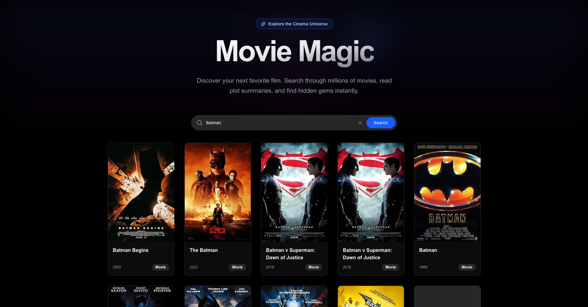
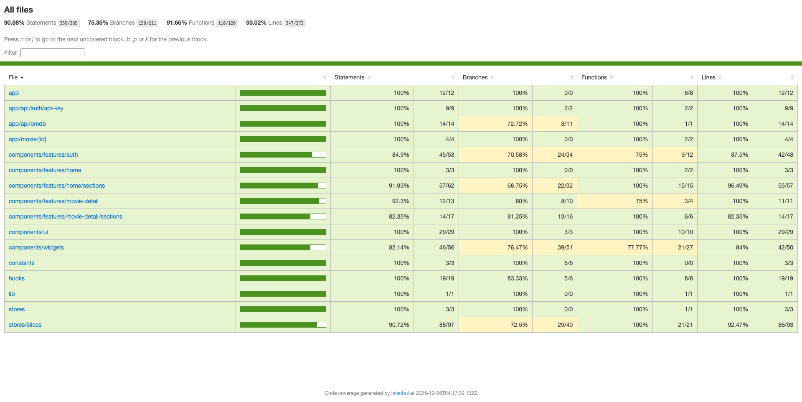
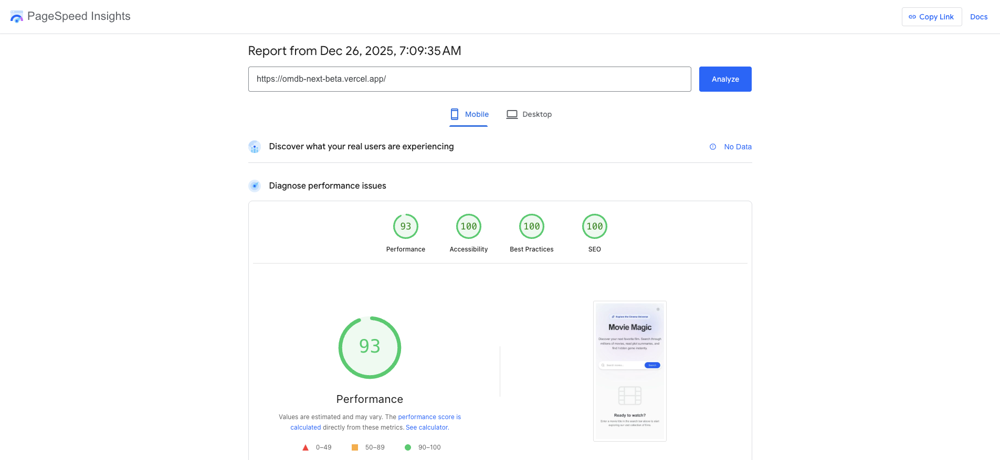

# OMDb Movie Search App



A modern, responsive React application built with Next.js 16, Redux Toolkit, and Tailwind CSS 4 to search for movies using the [OMDb API](https://www.omdbapi.com).

## Features

- **Movie Search**: Search for movies by title with infinite scrolling results.
- **Smart Autocomplete**: Live suggestions as you type (starts after 3 characters).
- **Movie Details**: Comprehensive details page including plot, ratings, and cast.
- **Poster Preview**: High-quality poster previews with modal view.
- **Theme Support**: First-class Dark Mode support that adapts to system preferences.
- **Secure API Key Management**: user-provided API keys are stored securely in HTTP-only cookies, ensuring they are never exposed to client-side JavaScript.
- **Responsive Design**: Mobile-first approach ensuring a great experience on all devices.

## Prerequisites

This project enforces strict version requirements to ensure stability and compatibility:

- **Node.js**: >= 24.4.1
- **npm**: >= 11.4.2
- **OMDb API Key**: Get a free key at [http://www.omdbapi.com/apikey.aspx](http://www.omdbapi.com/apikey.aspx)

## Installation

1. Clone the repository and navigate to the project directory.

2. Install dependencies:

   ```bash
   npm install
   ```

3. Set up environment variables:
   Copy the example environment file:

   ```bash
   cp .env.example .env
   ```

   Ensure `.env` contains the correct API URL (default provided):

   ```env
   NEXT_PUBLIC_APP_URL=http://localhost:3000
   NEXT_PUBLIC_OMDB_API_URL=https://www.omdbapi.com
   NEXT_PUBLIC_IMAGE_HOSTS=m.media-amazon.com # comma separated list of image hosts
   ```

## Running the Application

1. Start the development server:

   ```bash
   npm run dev
   ```

2. Open [http://localhost:3000](http://localhost:3000) in your browser.

3. **API Key Setup**:
   - Upon first visit, you will be prompted to enter your OMDb API Key.
   - Enter your key to unlock the application features.
   - You can update your key at any time via the settings icon in the header.

## Running Tests

This project uses Vitest for unit testing. To run the test suite:

```bash
npm run test
```

Below is the latest unit test coverage report.



## Architecture & Design Patterns

This project follows the **Container/Presentational Pattern** (also known as Smart/Dumb Components) to separate concerns between logic and UI. This ensures modularity, maintainability, and easier testing.

### 1. Feature Components (Containers / Smart)

Located in `src/components/features`, these components are responsible for **how things work**.

- **Responsibilities**: Fetching data, interacting with the Redux store, handling user interactions, and managing side effects.
- **Example**: `SearchSection` handles the input state, dispatches search actions to Redux, and passes the results down to the `SearchBar`.

### 2. Widget Components (Presentational / Dumb)

Located in `src/components/widgets`, these components are responsible for **how things look**.

- **Responsibilities**: Rendering UI based purely on props. They are stateless (or manage only local UI state like hover effects) and reusable.
- **Example**: `MovieCard` simply receives a `movie` object and an `onClick` handler. It doesn't know about Redux or the API.

### 3. UI Components (Primitive / Atomic)

Located in `src/components/ui`, these are the building blocks of the design system.

- **Responsibilities**: Providing low-level accessible elements (Buttons, Inputs, Badge).
- **Tech**: Built with Radix UI primitives and styled via Tailwind CSS.

## Project Structure

```bash
src/
├── app/                  # Next.js App Router (Pages, Layouts, API Routes)
│   ├── api/              # Backend API proxies (OMDb, Auth)
│   ├── movie/[id]/       # Movie Detail Page
│   └── page.tsx          # Home Page
├── components/
│   ├── features/         # Smart Container Components (Logic Layer)
│   │   ├── auth/         # API Key Management
│   │   ├── home/         # Home Page Sections (Hero, Search, List)
│   │   └── movie-detail/ # Detail Page Sections (Info, Rating, Plot)
│   ├── ui/               # Primitive UI Components (Button, Input, Card)
│   └── widgets/          # Reusable Presentational Components (MovieCard, SearchBar)
├── stores/               # Redux State Management
│   └── slices/           # Feature Slices (Movie)
├── lib/                  # Utilities
└── constants/            # Configuration constants
```

## Tech Stack

- **Framework**: Next.js 16 (React 19)
- **Language**: TypeScript
- **State Management**: Redux Toolkit
- **Styling**: Tailwind CSS 4
- **HTTP Client**: Axios
- **Testing**: Vitest + React Testing Library
- **State Persistence**: server-side cookies for secure auth state

## Web Vitals Scores

Below is the latest Web Vitals performance for the application.



<a href="https://pagespeed.web.dev/analysis/https-omdb-next-beta-vercel-app/sby6v4ls7f?form_factor=mobile" target="\_blank" rel="noopener noreferrer"> View Page Report</a>
